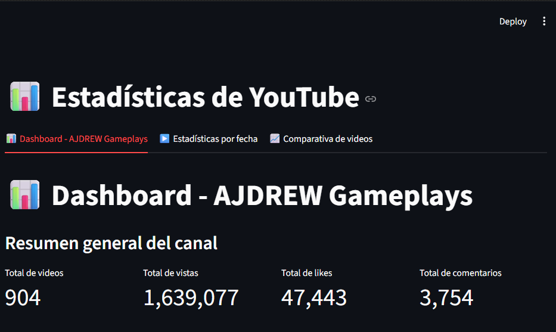
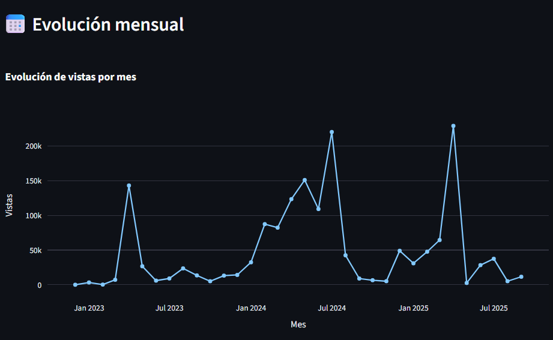
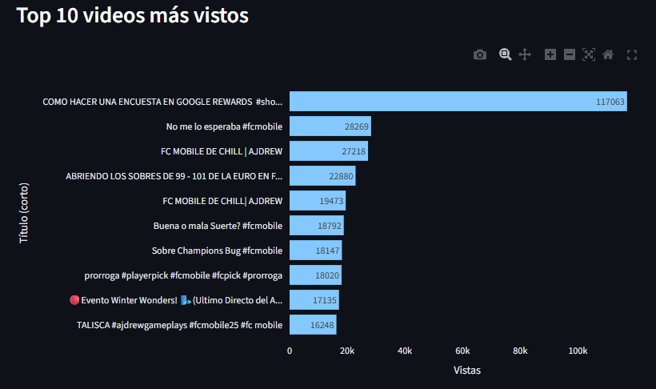
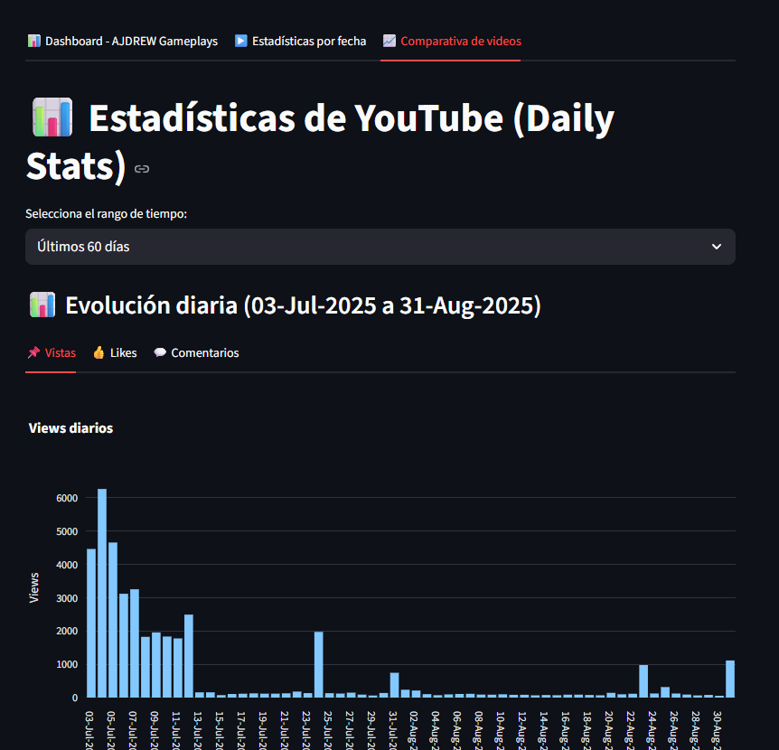

# 🎬 Dashboard YouTube - AJDREW Gameplays  

Este proyecto es un **dashboard interactivo** desarrollado con [Streamlit](https://streamlit.io/) para analizar estadísticas de un canal de YouTube. Permite visualizar métricas clave como **vistas, likes, comentarios**, evolución en el tiempo y ranking de videos.  

---

## ✨ Funcionalidades  

### 📊 Dashboard principal  
- Resumen general: total de videos, vistas, likes y comentarios.  
- Evolución diaria y mensual de vistas, likes y comentarios.  
- Comparación del último mes vs mes anterior.  
- Top 10 videos más vistos.  
- Tabla interactiva con miniaturas y filtros personalizados.  

### 📈 Estadísticas detalladas  
- Comparación de videos entre sí.  
- Gráficos interactivos con [Plotly](https://plotly.com/).  

### 📅 Estadísticas por fecha  
- Selección de rangos: últimos 7, 28, 60, 90 días o todo el historial.  
- Gráficos acumulados y diarios para vistas, likes y comentarios.  
- Métricas rápidas (totales y promedios).  

---

## 🛠️ Instalación  

1. **Clonar el repositorio**  

```bash
git clone <URL_REPOSITORIO>
cd <nombre_proyecto>
  

```

2. **Crear entorno virtual e instalar dependencias**

```bash
python -m venv venv
source venv/bin/activate   # Linux / Mac
venv\Scripts\activate      # Windows

pip install -r requirements.txt

```
3. **Configurar variables de entorno (.env)**
```bash

CHANNEL_ID=TU_CHANNEL_ID
API_KEY=TU_API_KEY
```
4. **Ejecutar la aplicación**
```bash
streamlit run src/main.py
```
### 📂 Estructura del proyecto
```bash

📦 proyecto
 ┣ 📂 data/              # Datos generados (ignorado en git)
 ┣ 📂 fetchs/            # Módulos para obtener datos de YouTube
 ┣ 📂 section/           # Secciones del dashboard
 ┣ 📂 src/               # Código principal
 ┣ .env                  # Variables de entorno (ignorado en git)
 ┣ .gitignore
 ┣ requirements.txt
 ┣ README.md

```
## 🚀 Tecnologías usadas
- [Python](https://www.python.org/) 
- [Streamlit](https://streamlit.io/)
- [Pandas](https://pandas.pydata.org/)
- [Plotly](https://plotly.com/)
- [YouTube Analytics API](https://developers.google.com/youtube/v3/docs/channels)
---


## 📸 Capturas  

| Dashboard | Comparativa | Estadísticas |
|-----------|-------------|--------------|
|  |  |  |

| Ranking | Detalle | Evolución |
|---------|---------|-----------|
|  |  |  |

---


## 👨‍💻 Autor
Proyecto desarrollado por **Andrew Licona**